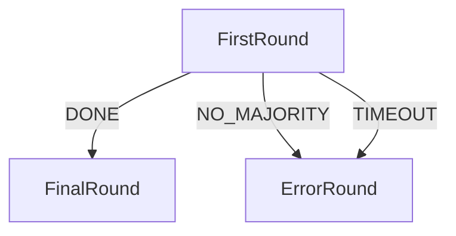

# Scaffolding a new FSM agent.

It can be difficult to scaffold an initial agent to begin development of the fsm.

The tools within the `fsm` subcommand are used to scaffold a new agent.

We start with a simple fsm;

```bash
cat auto_dev/data/fsm/samples/fsm_specification.yaml
```

Output:
```yaml
alphabet_in:
- DONE
- NO_MAJORITY
- TIMEOUT
default_start_state: FirstRound
final_states:
- ErrorRound
- FinalRound
label: DummyAbciApp
start_states:
- FirstRound
states:
- FirstRound
- FinalRound
- ErrorRound
transition_func:
  (FirstRound, DONE): FinalRound
  (FirstRound, NO_MAJORITY): ErrorRound
  (FirstRound, TIMEOUT): ErrorRound
```

We can then convert this to a mermaid diagram using the adev tool.

```bash
adev fsm from-file auto_dev/data/fsm/samples/fsm_specification.yaml --output mermaid DemoAbciApp
```

Output:
```txt
graph TD
  FirstRound
  FirstRound
  FinalRound
  ErrorRound
  FirstRound -->|DONE| FinalRound
  FirstRound -->|NO_MAJORITY| ErrorRound
  FirstRound -->|TIMEOUT| ErrorRound
```
which can be rendered as a mermaid diagram as so;



We now scaffold the agent.

```bash
adev create --no-clean-up -t eightballer/base author/new_agent
```
We now have a new agent.

```bash
cd new_agent
```

This creates a new agent without any real skills.

Once we have a new agent, we can first scaffold the skill using the CORE autonomy libraries.

This reduces the amount of code we need to write to get a skill up and means that we have no need to write any code to re-implement the wheel.

```bash
adev scaffold fsm --spec ../auto_dev/data/fsm/samples/fsm_specification.yaml
```

We now have an agent with a new skill, HOWEVER
The agent will not run.

One of the main reasons for this is that the agent is not configured to use the `aea_ledger_ethereum` package.

Additionally,

A number of connections need to be updated such that when deploying a service, the environment variables are set correctly.


# setup the agent

```bash
aea generate-key ethereum
```
```bash
aea add-key ethereum
```

```bash
echo run the agent with `aea run`
```

